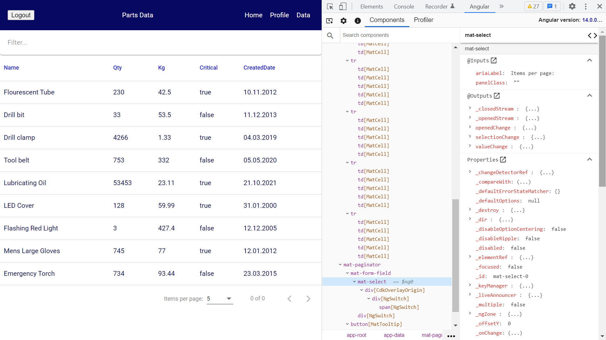

# :zap: Angular GraphQL Okta

* Angular used with Material components, Okta access control, GraphQL + Apollo to view a backend data set.
* **Note:** to open web links in a new window use: _ctrl+click on link_


## :page_facing_up: Table of contents

* [:zap: Angular GraphQL Okta](#zap-angular-graphql-okta)
  * [:page\_facing\_up: Table of contents](#page_facing_up-table-of-contents)
  * [:books: General info](#books-general-info)
  * [:camera: Screenshots](#camera-screenshots)
  * [:signal\_strength: Technologies](#signal_strength-technologies)
  * [:floppy\_disk: Setup](#floppy_disk-setup)
  * [:wrench: Testing](#wrench-testing)
  * [:computer: Code Examples](#computer-code-examples)
  * [:cool: Features](#cool-features)
  * [:clipboard: Status, Testing \& To-Do List](#clipboard-status-testing--to-do-list)
  * [:clap: Inspiration](#clap-inspiration)
  * [:file\_folder: License](#file_folder-license)
  * [:envelope: Contact](#envelope-contact)

## :books: General info

** Frontend

* Angular frontend uses Okta for auth login/logout with [OAuth 2.0 Authorization Code with PKCE flow](https://developer.okta.com/docs/guides/implement-grant-type/authcodepkce/main/#create-the-proof-key-for-code-exchange)
* `Data` page displays table of database data with working filter input

** Backend

* Apollo-server resolvers used to process GraphQL operations on database data
* uuid creates a unique id string for each part

## :camera: Screenshots



## :signal_strength: Technologies

* [Angular v15](https://angular.io/) javascript framework
* [Okta Angular SDK v4](https://github.com/okta/okta-angular)
* [Okta CLI](https://github.com/okta/okta-cli)
* [Okta](https://developer.okta.com/) has Authentication and User Management APIs that reduce development time with instant-on, scalable user infrastructure.
* [GraphQL v16](https://graphql.org/) API query language
* [Angular Material v15](https://material.angular.io/) menu toolbar & table to display data  
* [Apollo Client v3](https://www.apollographql.com/docs/react/) used with [Apollo-Angular v3](https://apollo-angular.com/) GraphQL Client for Angular Framework

* [Node.js v16](https://nodejs.org/) Javascript runtime using the [Chrome V8 engine](https://v8.dev/)
* [Apollo Server v3](https://www.apollographql.com/docs/apollo-server/getting-started/) for unified data communications
* [uuid v9](https://www.npmjs.com/package/uuid) to create RFC4122 UUIDs

## :floppy_disk: Setup

** Frontend

* `npm i` to install dependencies
* You will need to [install the Okta CLI](https://github.com/okta/okta-cli#installation). I installed it on Windows 10 Home using the [Chocolatey package manager](https://chocolatey.org/)
* You will need an Okta developer account then use `okta login` to integrate it with the Okta CLI.
* In Okta apps, create a client app then add options: Type of Application: SPA, Redirect URI: `http://localhost:4200/login/callback`, Logout Redirect URI: `http://localhost:4200` (You must add these redirect URIs or login will not work)
* Add issuer and Client-ID to `app.module.ts`
* `ng serve` runs frontend on `http://localhost:4200` with auto-restart after changes

** Backend

* `npm i` to install dependencies
* `npm run dev` to start node server

## :wrench: Testing

* tba

## :computer: Code Examples

* Frontend `graphql.queries.ts` code to define what fields should be returned with a `parts` query

```typescript
import { gql } from 'apollo-angular';

const PARTS_LIST = gql`
  query {
    parts {
      name
      quantity
      weight
      criticalPart
      createdDate
    }
  }
`;

export { PARTS_LIST };
```

## :cool: Features

* Material table to display backend data
* GraphQL uses strong data types and ensures no over or under-fetching od data
* Okta Authguard to restrict user access to certain pages

## :clipboard: Status, Testing & To-Do List

* Status: Working, unfinished.
* To-Do frontend: new nav bar & Okta access data.
* To-Do backend: add data API-postgres? Use filter functions or remove.

## :clap: Inspiration

* [Apollo-Angular documentation](https://apollo-angular.com/docs/development-and-testing/using-typescript)

## :file_folder: License

* This project is licensed under the terms of the MIT license.

## :envelope: Contact

* Repo created by [ABateman](https://github.com/AndrewJBateman), email: gomezbateman@yahoo.com
